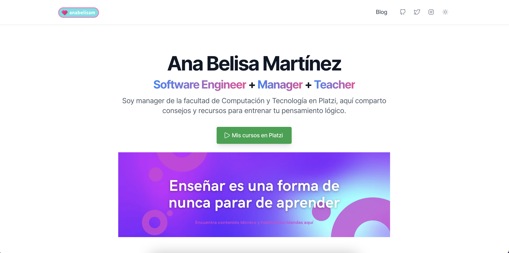

# 💖 Ana Belisa Martinez - Blog 

> He recreado mi página web personal utilizando el template AstroWind de Astro + Tailwind CSS.
> Hay muchas configuraciones y detalles por afinar, si quieres ayudarme a mejorarlo recibiré tus aportes con mucho agradecimiento 💜.

## Contenido que encontrarás
Podrás acceder a mis recomendaciones y enlaces a todas las fuentes donde te ofrezco contenido acerca de desarrollo web, php y principalmente Pensamiento Lógico.

En el apartado de **blog** encontrarás los posts que he escrito durante los últimos años con mis experiencias y consejos para planear proyectos, tutoriales e incluso algunas historias de experiencias que me han impactado a nivel personal desde mi carrera profesional.

### About me
Empecé mi carrera profesional como desarrolladora web, en 2017 empecé a conocer el ecosistema de comunidades hasta que en 2019 inicié mi transición profesional hacia el management y la educación. Con toda mi experiencia en conjunto ahora quiero compartirte aquello que he aprendido y con lo que quiero que aprendas y crezcas mucho en todo lo que quieras hacer.

### Demo
En (anabelisa.co)[https://anabelisa.co/] encontrarás la siguiente portada

## Original license by Astro

**AstroWind** is licensed under the Unlicense license — see the [LICENSE](https://github.com/onwidget/astrowind/blob/main/LICENSE.md) file for details.
